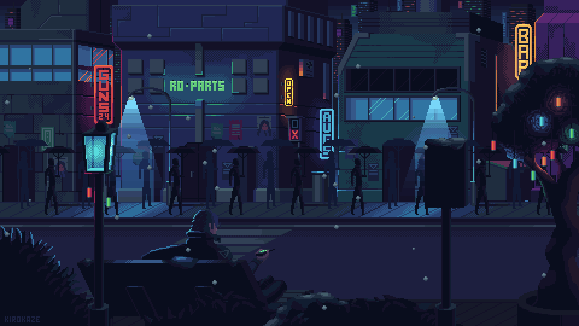

  

### 👨‍💻 About Me

I'm a C/C++ developer with over 2 years of experience at BottomUp Technology, working on embedded systems in the R&D team.

-- 🔌 I develop embedded software using C/C++
- 🧪 I develop and automate tests for large-scale production with Python
- 🐧 I use Linux and Docker in my daily workflow
- 🌐 I also have experience with Java, Flask, Django and JavaScript frameworks like Next.js and React  
- 📚 I contribute to technical documentation

---

### 🚀 Tech Stack

  
  
  
  
  
  
  
  

